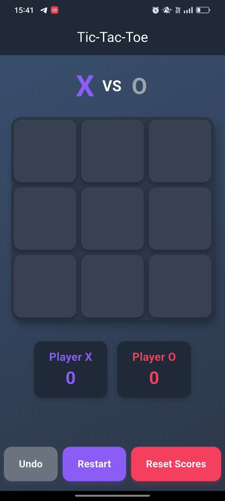

# Tic-Tac-Toe Flutter App 🎮

A simple **Tic-Tac-Toe game** built using **Flutter & GetX** for Android & iOS.  
This app allows **two players** to play on the same device with animations, win highlights, undo, and restart features.

---

## Features ✨
- Two-player game on the same device  
- 3×3 grid UI with current player display (X or O)  
- Detects and indicates a **win** or a **draw**  
- **Undo** last move, **Restart** board, **Reset scores**  
- Confetti and glow animation on win  
- Fully **responsive** UI for all screen sizes  
- Professional and polished design  

---

## Screenshots 📱
   

*(Optional: Replace with your actual screenshots.)*

---

## How to Run 🏃‍♂️
1. Clone the repo:  
```bash
git clone https://github.com/waseyjamal/flutter_tic_tac_toe_assignment.git
cd flutter_tic_tac_toe_assignment
Install dependencies:

bash
Copy code
flutter pub get
Run on your device or emulator:

bash
Copy code
flutter run
Tech Stack 🛠
Flutter (Dart)

GetX for state management

Confetti package for win animations

Extra Notes 💡
Tested on mobile & tablet devices

Fully responsive and polished UI

Ready for demo recording submission

## Demo Video
[Watch Demo Video](tic_tec_toe-v.mp4)

Author 👨‍💻
Wasey Jamal

GitHub: https://github.com/waseyjamal
